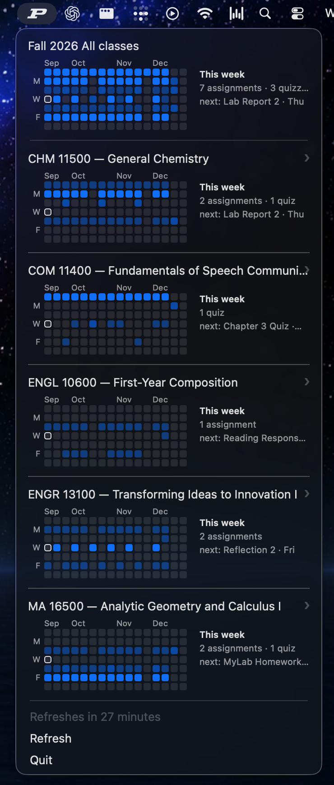

# BrightspaceBar

A macOS menu-bar app for Purdue Brightspace (D2L): your courses, a GitHub-style
due-date heatmap per class, and one-click deep links that land already signed
in — without your credentials ever touching the app.

<!-- TODO: add docs/screenshot.png — the menu open, showing the aggregate
     heatmap, a course row, and a day popup. -->


## What it does

- **A heatmap per course** — each current course is a row with a
  GitHub-contributions-style grid of the coming weeks: darker squares mean
  heavier work (assignment < quiz < test), today is outlined.
- **An "All classes" aggregate** on top, folding every course's grid into one.
- **Hover a day, see the work** — a popup lists that day's items; clicking one
  opens it in a persistent, already-signed-in Chromium (each click adds a tab).
- **"This week" at a glance** — per-course counts and the next due item, right
  beside the grid.
- **Your own items** — add assignments/quizzes/tests with a date picker from
  each course's submenu; they render in the grid like fetched ones and delete
  with an ✕ from the popup.
- **Background refresh** every 30 minutes, silently, via a session the app
  never sees.

## How it stays safe

The app is two halves with a deliberate wall between them:

- A **Swift menu-bar app** that renders cached JSON. It contains no network
  code and no credentials — it cannot log in *by construction*.
- A **Node daemon** (`session-capture/`) that owns the browser session: a
  one-time interactive login into a persistent Chromium profile, then silent
  cookie/JWT renewal on a ladder that only escalates as far as it must.

Your email and password are typed once, by you, into Microsoft's real login
page in a real browser window. They are never stored by this project, never
logged, and never cross into the Swift process (invariant **D7**). The app
only ever spawns the daemon in its non-interactive mode (invariant **D8**).

## Requirements

- macOS 14+
- Xcode Command Line Tools with Swift 6.2+ (`xcode-select --install`)
- Node 20+ (`brew install node`)
- A Purdue career account (the SAML entity is currently Purdue-specific —
  PRs generalising it are welcome)

## Install

```sh
git clone https://github.com/DavidChen-006/BrightspaceBar.git
cd BrightspaceBar
make setup    # checks prerequisites, installs the daemon's dependencies
make login    # one-time: a Chromium window opens — sign in with your Purdue account
make run      # the icon appears in your menu bar
```

After `make login`, the daemon refreshes the session silently; you should not
see a login again for weeks. If courses ever stop refreshing, run `make login`
once more.

## Project layout

| Path | What it is |
| --- | --- |
| `BrightspaceBar/` | The Swift package: the menu-bar app and its modules (`Modules/<Name>/`), tests included |
| `session-capture/` | The Node daemon: login ladder, data fetch, deep-link opener |
| `docs/` | Design documents |

The numbered `experiment-*` probes that de-risked each design decision live on
the [`experiments` branch](https://github.com/DavidChen-006/BrightspaceBar/tree/experiments/experiments)
— kept as engineering notes, off the main tree.

Architecture rules (enforced by tests): the GUI imports only the `CourseMenu`
contract module; adapters translate between pipelines and the menu model; the
composition root is `main.swift`. See [CONTRIBUTING.md](CONTRIBUTING.md).

## Development

```sh
make test                     # full suite, from the repo root
make -C BrightspaceBar run    # run the app from source
```

## License

[MIT](LICENSE). Not affiliated with Purdue University or D2L Corporation;
Brightspace is a trademark of D2L.
